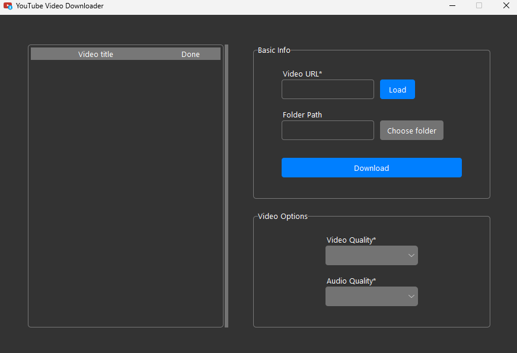

# YouTubeDownloader
A tool used for downloading YouTube videos.  

___
## How to install
1. Download ffmpeg (https://github.com/BtbN/FFmpeg-Builds/releases) and extract it into a folder called "ffmpeg"
2. Run "pip install -r requirements.txt"
3. Run main.py

## How to use
First you need to load a video by pasting the url and pressing "Load".  
Folder is optional and if not given, it will create a "downloads" folder.  
Video options can be selected after loading the video.
After selecting proper options, press "Download". This will start the download.  
When the downloading is done, "done" will be "yes".  
NOTE: If video options won't load, try pressing the load button again.